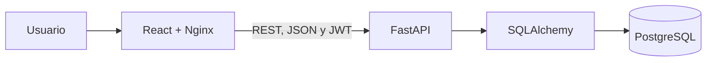

# ReservApp


**ReservApp** es una plataforma web multi-negocio para consultar disponibilidad y administrar reservaciones de servicios.

Está diseñada para negocios como barberías, spas, clínicas, gimnasios, restaurantes, hoteles y otros establecimientos que trabajan mediante citas o recursos reservables.

Los clientes pueden registrarse, consultar negocios, revisar horarios disponibles, crear reservaciones y cancelarlas. Los propietarios pueden administrar su negocio, sus recursos, sus reservaciones y visualizar métricas desde un panel administrativo.

---

## Aplicación desplegada

- **Frontend:** [ReservApp en Azure](https://reservapp-web-gnb5f6cqa4e0bqar.centralus-01.azurewebsites.net/)
- **API:** [ReservApp API](https://reservapp-api-etcdecbmacagapeg.centralus-01.azurewebsites.net/api)
- **Repositorio:** [sayubasiik/Reservapp](https://github.com/sayubasiik/Reservapp)

La documentación interactiva de FastAPI se encuentra en la ruta `/docs` del backend.

---

## Objetivo

ReservApp busca centralizar y simplificar el proceso de reservación entre clientes y negocios.

El sistema resuelve problemas como:

- Reservaciones registradas manualmente.
- Horarios duplicados o traslapados.
- Falta de control sobre los recursos disponibles.
- Dificultad para consultar reservaciones activas.
- Ausencia de métricas para los propietarios.
- Falta de reportes administrativos.
- Información separada entre clientes y negocios.

---

## Funcionalidades principales

### Autenticación y usuarios

- Registro de usuarios.
- Inicio de sesión.
- Autenticación mediante JSON Web Tokens.
- Contraseñas almacenadas de forma segura mediante hash.
- Sesiones protegidas.
- Control de acceso basado en roles.
- Protección de rutas privadas en frontend y backend.

### Administración de negocios

- Registro y configuración de negocios.
- Consulta de información del negocio.
- Actualización de datos.
- Asociación del negocio con su propietario.
- Separación de la información entre diferentes negocios.

### Administración de recursos

Un recurso representa cualquier elemento que puede reservarse, por ejemplo:

- Un barbero.
- Un consultorio.
- Una mesa.
- Una habitación.
- Una cancha.
- Un equipo.
- Un espacio de atención.

El propietario puede:

- Registrar recursos.
- Consultarlos.
- Modificarlos.
- Configurar su disponibilidad.
- Desactivarlos o eliminarlos según las reglas del sistema.

### Reservaciones

- Consulta de disponibilidad.
- Creación de reservaciones.
- Consulta de reservaciones del cliente.
- Consulta administrativa de reservaciones.
- Cancelación de reservaciones.
- Validación de fechas y horarios.
- Prevención de traslapes.
- Asociación entre cliente, negocio y recurso.
- Control del estado de cada reservación.

### Dashboard administrativo

El panel administrativo presenta información relevante del negocio mediante:

- Indicadores generales.
- Total de reservaciones.
- Reservaciones activas y canceladas.
- Recursos registrados.
- Distribución de reservaciones.
- Métricas para apoyar la toma de decisiones.
- Gráficas generadas con información real del sistema.

### Reportes PDF

Los propietarios pueden generar reportes en formato PDF que contienen:

- Información general del negocio.
- Resumen de reservaciones.
- Indicadores administrativos.
- Gráficas.
- Texto explicativo.
- Presentación ordenada y profesional.

---

## Roles y permisos

| Rol | Identificador | Permisos principales |
|---|---|---|
| Cliente | `client` | Consultar negocios, revisar disponibilidad, crear reservaciones y administrar sus propias reservaciones |
| Propietario | `business_owner` | Administrar su negocio, recursos, reservaciones, dashboard y reportes |
| Administrador | `admin` | Supervisar usuarios, negocios y operaciones generales del sistema |

El backend valida los permisos independientemente del frontend. Ocultar una opción en la interfaz no sustituye la autorización del servidor.

---

## Arquitectura

ReservApp utiliza una arquitectura cliente-servidor.



El frontend consume los servicios REST del backend. FastAPI procesa las solicitudes, valida los permisos y utiliza SQLAlchemy para consultar o modificar la información almacenada en PostgreSQL.

---

## Tecnologías utilizadas

### Frontend

| Tecnología | Uso |
|---|---|
| React | Construcción de la interfaz mediante componentes |
| TypeScript | Tipado estático y prevención de errores |
| Vite | Entorno de desarrollo y construcción del frontend |
| React Router | Navegación y protección de rutas |
| Context API | Manejo del estado de autenticación |
| CSS | Diseño responsivo y estilos de la aplicación |
| Nginx | Publicación del frontend en producción |

### Backend

| Tecnología | Uso |
|---|---|
| Python | Lenguaje principal del backend |
| FastAPI | Desarrollo de la API REST |
| SQLAlchemy | Modelado y acceso a la base de datos |
| Pydantic | Validación de solicitudes y respuestas |
| Alembic | Migraciones de base de datos |
| JSON Web Tokens | Autenticación de usuarios |
| python-jose | Creación y validación de tokens |
| Bcrypt | Protección de contraseñas |
| Uvicorn | Servidor ASGI |
| Pytest | Pruebas automatizadas |
| HTTPX | Pruebas de los servicios HTTP |

### Base de datos e infraestructura

| Tecnología | Uso |
|---|---|
| PostgreSQL | Persistencia relacional de los datos |
| SQLite | Base ligera utilizada en determinados escenarios de prueba |
| Docker | Creación de entornos reproducibles |
| Docker Compose | Ejecución local de los servicios |
| GitHub Actions | Integración y despliegue continuo |
| Azure App Service | Hospedaje del frontend y backend |
| Azure Database for PostgreSQL | Base de datos de producción |
| Azure Container Registry | Almacenamiento de imágenes de contenedores |

---

## ¿Por qué se eligieron estas tecnologías?

- **React** permite construir una interfaz dinámica y reutilizable.
- **TypeScript** ayuda a detectar errores antes de ejecutar la aplicación.
- **Vite** proporciona un entorno de desarrollo rápido.
- **FastAPI** facilita la creación de servicios REST, incluye validaciones y genera documentación OpenAPI automáticamente.
- **SQLAlchemy** separa la lógica del sistema de las consultas directas a la base de datos.
- **PostgreSQL** es adecuado para las relaciones existentes entre usuarios, negocios, recursos y reservaciones.
- **JWT** permite autenticar solicitudes entre frontend y backend.
- **Docker** mantiene un entorno consistente entre desarrollo, pruebas y producción.
- **Azure** permite publicar la aplicación, la API y la base de datos en la nube.
- **GitHub Actions** automatiza las verificaciones antes de integrar o desplegar cambios.

---

## Modelo general de datos

Las entidades principales son:

### Usuario

Representa a las personas registradas en la plataforma.

Un usuario puede ser cliente, propietario o administrador.

### Negocio

Contiene la información del establecimiento registrado por un propietario.

### Recurso

Representa la unidad que puede ser reservada y pertenece a un negocio.

### Reservación

Relaciona a un cliente con un recurso durante una fecha y horario determinados.

Relaciones principales:

- Un propietario puede administrar un negocio.
- Un negocio puede tener varios recursos.
- Un recurso puede tener varias reservaciones en horarios diferentes.
- Un cliente puede realizar varias reservaciones.
- Una reservación pertenece a un cliente y a un recurso.

---

## Estructura del proyecto

```text
Reservapp/
├── backend/
│   ├── app/
│   │   ├── core/          # Configuración, seguridad y dependencias
│   │   ├── models/        # Modelos de SQLAlchemy
│   │   ├── routers/       # Rutas y endpoints REST
│   │   ├── schemas/       # Esquemas y validaciones de Pydantic
│   │   ├── services/      # Reglas de negocio
│   │   └── main.py        # Inicialización de FastAPI
│   ├── tests/             # Pruebas automatizadas
│   └── requirements.txt   # Dependencias de Python
│
├── frontend/
│   ├── src/
│   │   ├── api/           # Comunicación con el backend
│   │   ├── auth/          # Contexto y protección de autenticación
│   │   ├── components/    # Componentes reutilizables
│   │   ├── hooks/         # Hooks personalizados
│   │   ├── pages/         # Pantallas de la aplicación
│   │   ├── routes/        # Configuración de navegación
│   │   └── types/         # Tipos e interfaces de TypeScript
│   ├── package.json
│   └── package-lock.json
│
├── .github/
│   └── workflows/         # Integración y despliegue continuo
├── docker-compose.yml
└── README.md
```

---

## Módulos de la API

La API contiene operaciones para los siguientes módulos:

| Módulo | Responsabilidad |
|---|---|
| Autenticación | Registro, inicio de sesión y generación de tokens |
| Usuarios | Consulta y administración de usuarios |
| Negocios | Registro y configuración de negocios |
| Recursos | CRUD de recursos reservables |
| Reservaciones | Disponibilidad, creación, consulta y cancelación |
| Dashboard | Obtención de métricas administrativas |
| Reportes | Preparación de información para reportes PDF |
| Health check | Verificación del estado del backend |

La versión desplegada expone sus operaciones bajo el prefijo `/api`.

---

## Reglas de negocio importantes

- No se permiten reservaciones traslapadas para el mismo recurso.
- El horario de inicio debe ser anterior al horario de finalización.
- Un cliente solamente puede administrar sus propias reservaciones.
- Un propietario solamente puede administrar la información correspondiente a su negocio.
- Las rutas administrativas requieren el rol adecuado.
- Las reservaciones canceladas conservan su registro para mantener el historial.
- El backend valida los datos aunque el frontend ya los haya validado.
- Los indicadores distinguen entre reservaciones activas y canceladas.
- El sistema no procesa pagos reales con tarjeta.
- El alcance actual contempla la reservación directa o el pago en el establecimiento.

---

## Variables de entorno

Las credenciales reales nunca deben subirse al repositorio.

### Backend

```env
PROJECT_NAME=ReservApp
DATABASE_URL=<cadena-de-conexion-postgresql>
SECRET_KEY=<clave-secreta-segura>
ALGORITHM=HS256
ACCESS_TOKEN_EXPIRE_MINUTES=<duracion-del-token>
CORS_ORIGINS=["http://localhost","http://localhost:5173"]
ADMIN_EMAIL=<correo-del-administrador>
ADMIN_PASSWORD=<contraseña-segura>
WEBSITES_PORT=8000
```

### Frontend

```env
VITE_API_URL=http://localhost:8000/api
VITE_USE_MOCK_API=false
```

En producción, `VITE_API_URL` debe apuntar a la API desplegada en Azure.

---

## Ejecución con Docker

### Requisitos

- Git.
- Docker Desktop.
- Docker Compose.

### 1. Clonar el repositorio

```bash
git clone https://github.com/sayubasiik/Reservapp.git
cd Reservapp
git switch production
```

### 2. Configurar las variables de entorno

Configura las variables indicadas anteriormente antes de levantar los servicios.

### 3. Construir e iniciar los contenedores

```bash
docker compose up -d --build
```

### 4. Ejecutar las migraciones

```bash
docker compose exec backend python -m alembic upgrade head
```

### 5. Cargar datos iniciales

```bash
docker compose exec backend python -m app.seed
```

### 6. Verificar los servicios

Con la configuración local del proyecto:

- Frontend: `http://localhost`
- Backend: `http://localhost:8000`
- Documentación API: `http://localhost:8000/docs`
- PostgreSQL: `localhost:5433`

### Detener los servicios

```bash
docker compose down
```

---

## Ejecución manual

### Backend

Desde PowerShell:

```powershell
cd backend

py -m venv .venv
.\.venv\Scripts\Activate.ps1

python -m pip install -r requirements.txt
python -m alembic upgrade head
uvicorn app.main:app --reload
```

El backend estará disponible en:

```text
http://localhost:8000
```

La documentación interactiva estará disponible en:

```text
http://localhost:8000/docs
```

### Frontend

En otra terminal:

```powershell
cd frontend
npm ci
npm run dev
```

El servidor de Vite mostrará en la terminal la dirección local del frontend, normalmente:

```text
http://localhost:5173
```

Para ejecutar el proyecto manualmente es necesario contar con PostgreSQL disponible y configurar correctamente `DATABASE_URL`.

---

## Pruebas y validaciones

### Backend

Desde la carpeta `backend`:

```bash
python -m pytest -q
```

Con Docker:

```bash
docker compose exec backend python -m pytest -q
```

La suite automatizada valida, entre otros aspectos:

- Registro e inicio de sesión.
- Generación y validación de tokens.
- Protección de rutas.
- Roles y permisos.
- Health check.
- Recursos.
- Negocios.
- Creación de reservaciones.
- Prevención de traslapes.
- Cancelación de reservaciones.
- Validaciones y códigos de respuesta HTTP.

La versión estable del proyecto cuenta con **34 pruebas automatizadas**.

### Frontend

```bash
cd frontend
npm ci
npm run lint
npm run build
```

Estas instrucciones permiten verificar la calidad del código y confirmar que el frontend puede compilarse para producción.

---

## Seguridad

ReservApp incorpora las siguientes medidas:

- Hash de contraseñas con Bcrypt.
- Autenticación mediante JWT.
- Expiración configurable de tokens.
- Validación de datos mediante Pydantic.
- Autorización por roles.
- Protección de rutas privadas.
- Restricción de recursos según el usuario autenticado.
- Configuración de CORS.
- Secretos almacenados mediante variables de entorno.
- Separación entre configuración de desarrollo y producción.
- Validaciones del lado del servidor.
- Verificaciones automáticas antes de integrar cambios.

---

## Despliegue

El proyecto se encuentra desplegado en Microsoft Azure.

La infraestructura utiliza:

- Azure App Service para el frontend.
- Azure App Service para la API.
- Azure Database for PostgreSQL Flexible Server.
- Azure Container Registry.
- Nginx para servir el frontend.
- GitHub Actions para integración y despliegue continuo.

El flujo general de despliegue es:

1. Se realiza un cambio en una rama de trabajo.
2. Se abre un Pull Request.
3. GitHub Actions ejecuta las verificaciones automáticas.
4. El equipo revisa y fusiona los cambios.
5. Se construyen las imágenes necesarias.
6. Azure actualiza los servicios desplegados.
7. Se realiza un smoke test en producción.

---

## Estado actual

| Componente | Estado |
|---|---|
| API REST | Implementada |
| Autenticación JWT | Implementada |
| Autorización por roles | Implementada |
| Base de datos PostgreSQL | Implementada |
| CRUD de negocios y recursos | Implementado |
| Gestión de reservaciones | Implementada |
| Prevención de traslapes | Implementada |
| Integración frontend-backend | Implementada |
| Dashboard administrativo | Implementado |
| Gráficas dinámicas | Implementadas |
| Reportes PDF | Implementados |
| Pruebas automatizadas | Implementadas |
| CI/CD | Configurado |
| Despliegue en Azure | Activo |

---

## Alcance actual

ReservApp incluye las funciones esenciales para la gestión de reservaciones entre clientes y negocios.

No forman parte del alcance actual:

- Pagos reales con tarjeta.
- Procesamiento bancario.
- Aplicación móvil nativa.
- Integraciones con plataformas externas de pago.
- Funciones sociales avanzadas.

Estas características pueden considerarse como mejoras futuras.

---

## Equipo de desarrollo

Proyecto desarrollado por estudiantes de Ingeniería en Sistemas Computacionales de la Universidad Politécnica de Aguascalientes:

- Alan Leonardo López Valdez
- Daniel Alejandro Villanueva Ambriz
- Kevin Olaf Quezada Vieyra
- Sayuri Luriel Valle Escobar
- Sebastián Román Gutiérrez

---

## Propósito académico

ReservApp fue desarrollado como proyecto integrador para demostrar la aplicación de conocimientos relacionados con:

- Diseño y consumo de APIs REST.
- Operaciones CRUD.
- Autenticación y autorización.
- Bases de datos relacionales.
- Integración frontend-backend.
- Desarrollo de dashboards.
- Generación de reportes PDF.
- Pruebas automatizadas.
- Contenedores.
- Control de versiones.
- Integración continua.
- Despliegue de aplicaciones en la nube.

---

## Aviso

Este proyecto fue desarrollado con fines académicos. Las cuentas, credenciales y datos utilizados para demostraciones no deben reutilizarse en sistemas reales.
